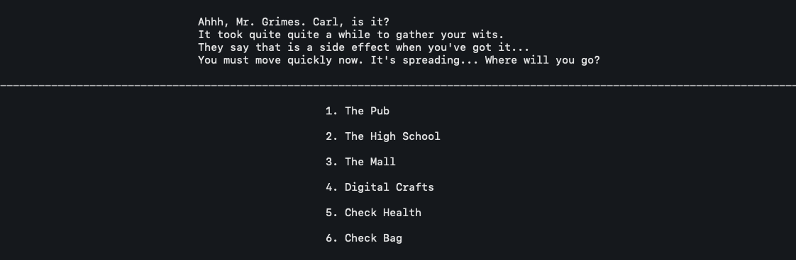

# Pandemic! Role-Playing Game

## Summary

Venture, if you dare, into a world ravaged by a pandemic, which causes its hosts to become zombies. Battle your way through 5 distinct locations to find the cure and save the world!

## Technologies

* Python
* Object-oriented programming (Classes)
* Unix Terminal (hosts gameplay)

## Screenshots

RPG Main Menu:

Zombie Attack Sequence, Location Selection, and Bag Contents Menus:

